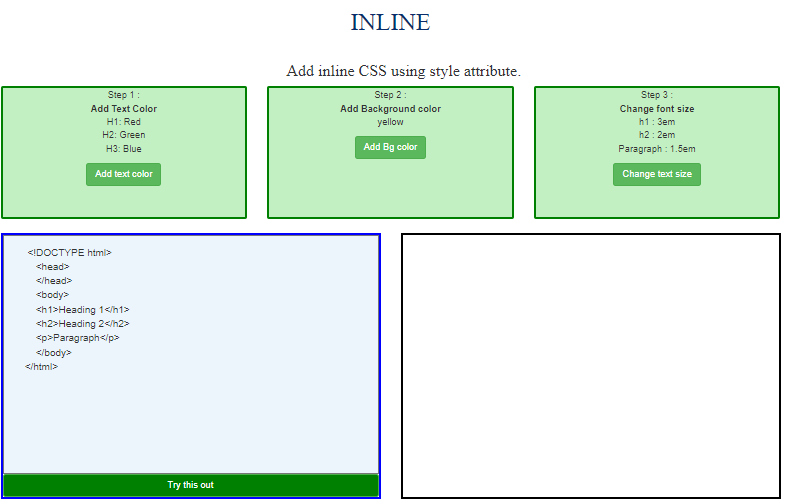
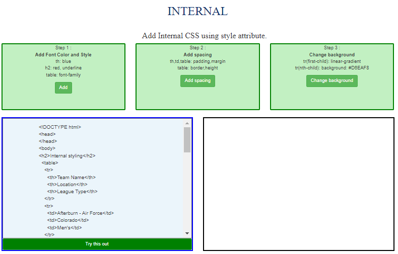

##### These procedure steps will be followed on the simulator

1. Study the demo code given and understand the use of the type of styling
 

2.  Basic and Advanced use of the styles are given for better understanding.
  

3. Write the code in the given editor window and press the run button.
 

4. The output will be seen in the result window.
 

